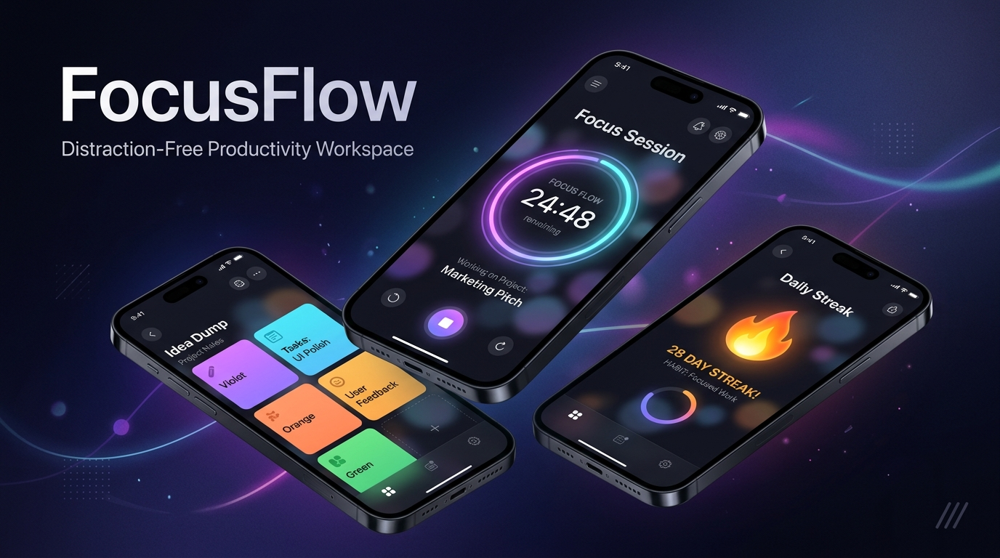
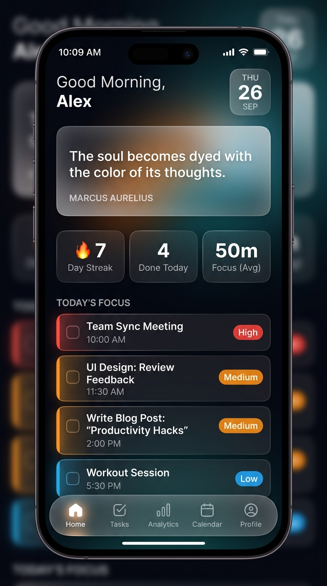
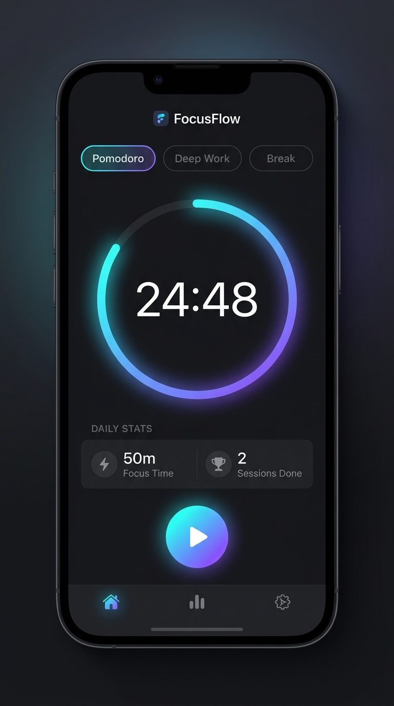
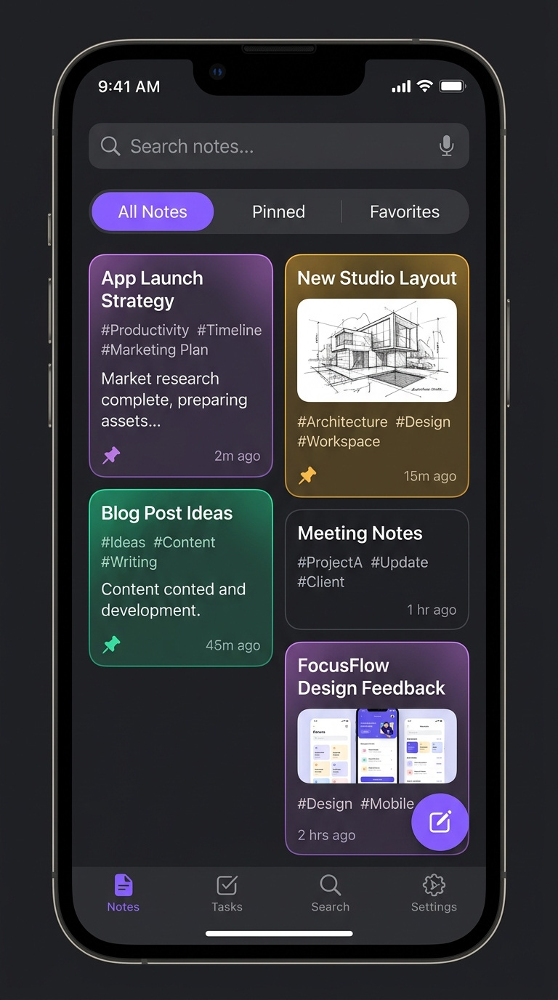
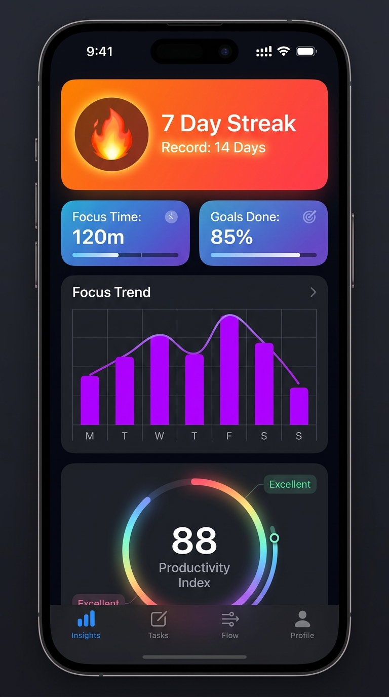
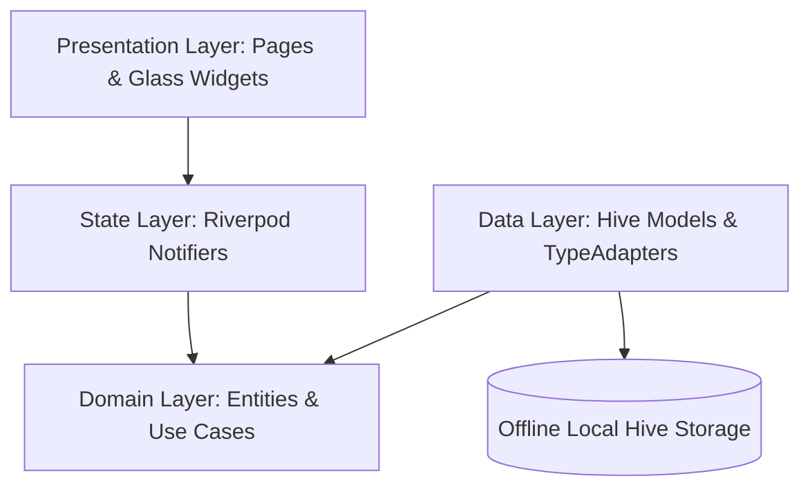

<div align="center">



<br/><br/>

# ⚡ FocusFlow
### *Distraction-Free Productivity Sanctuary*

[](https://flutter.dev)
[](https://dart.dev)
[](https://riverpod.dev)
[](https://docs.hivedb.dev)
[]()
[](LICENSE)

<p align="center">
  <b>FocusFlow</b> merges thought organization, task execution, deep work focus sessions, and stoic habit tracking into one fluid, glassmorphic workspace.
</p>

[Explore Features](#-features-showcase) • [UI Showcase](#-app-interface--screenshots) • [Architecture](#-clean-architecture) • [Getting Started](#-installation--setup) • [Build APK/AAB](#-apk--app-bundle-deployment)

---

</div>

## 🌌 The FocusFlow Philosophy

Most productivity tools suffer from two extremes: rigid, complex admin dashboards or simplistic checklists locked behind subscriptions.

**FocusFlow** takes inspiration from **Japanese Minimalist Zen**, **Arc Browser**, and **Apple Human Interface Guidelines**:

* 🧘 **Calm by Design**: Soft glassmorphism (`BackdropFilter` sigma blur), floating pill navigation, and muted organic gradients.
* 🔒 **100% Offline-First**: Zero tracking, zero telemetry, zero servers, and instant sub-millisecond local storage via Hive.
* ⚡ **Holistic Flow State**: Your thoughts (*Notes*), actions (*Tasks*), attention (*Focus Timer*), and mindset (*Stoic Quotes*) coexist effortlessly.

---

## 📱 App Interface & Screenshots

<div align="center">

| 🏠 Home Dashboard | ⏱️ Focus Timer (Deep Flow) |
| :---: | :---: |
|  |  |
| *Time-based greeting, daily stoic quote, and velocity cards* | *Custom-painted glowing circular progress ring with multi-mode timer* |

<br/>

| 📝 Note Sanctuary | 📊 Momentum & Insights |
| :---: | :---: |
|  |  |
| *Masonry note cards with custom canvas tints & `#tag` search* | *Habit streak flame, 7-day FL Chart trend & Productivity Index* |

</div>

---

## ✨ Features Showcase

### 1. 📝 Thought Sanctuary (Notes)
- **Fluid Organization**: Instant capture with custom canvas tint palettes (*Indigo, Emerald, Warm Amber, Violet, Sky*).
- **Organization & Tags**: Pin critical notes, bookmark favorites, and filter across titles, contents, or `#tags`.
- **Auto-Save Engine**: Intelligent debounced auto-save ensures you never lose a single keystroke.

### 2. 🎯 Daily Velocity (Tasks)
- **Priority Matrix**: Color-coded priority hierarchy (*Urgent*, *High*, *Medium*, *Low*).
- **Progress Tracking**: Real-time circular velocity indicator showing percentage of today's conquered goals.
- **Interactive Gestures**: Smooth swipe-to-delete, animated checkbox micro-interactions, and due date scheduler.

### 3. ⏱️ Immersive Focus Timer
- **Three Flow Modalities**:
  - 🍅 **Pomodoro**: 25-minute concentrated work sprints
  - 🧠 **Deep Work**: 90-minute immersion sessions for complex problem solving
  - ☕ **Recharge / Break**: 5-minute restorative rest
- **Custom-Painted Sweep Arc**: Multi-stop gradient ring with glowing center dot and live second countdown.
- **Automated Logging**: Completed focus sessions automatically record to your lifetime stats.

### 4. 💡 Daily Inspiration & Stoic Wisdom
- **Curated Database**: 50+ hand-picked philosophical insights from *Marcus Aurelius, Seneca, Epictetus, James Clear, Cal Newport, Naval Ravikant, and Steve Jobs*.
- **Daily Reflection**: Deterministic daily quote generation with instant shuffle.

### 5. 📊 Habit & Momentum Analytics
- **Streak Flame**: Consecutive active day tracking with record milestones.
- **Weekly Trend**: Interactive 7-day focus chart powered by FL Chart.
- **Productivity Index**: Composite daily score evaluating focus depth and completed task velocity.

---

## 🎨 Triple-Theme Aesthetics

FocusFlow provides three themes:

```
┌────────────────────────┬────────────────────────┬────────────────────────┐
│     ☀️ Light Slate     │     🌙 Obsidian Dark   │     🖤 AMOLED Pitch    │
├────────────────────────┼────────────────────────┼────────────────────────┤
│ Clean daylight canvas  │ Frosted glass surfaces │ Pure black #000000     │
│ with indigo accents &  │ with neon violet glow  │ for maximum OLED       │
│ crisp typography       │ & relaxed contrast     │ battery efficiency     │
└────────────────────────┴────────────────────────┴────────────────────────┘
```

---

## 🏗️ Clean Architecture

FocusFlow strictly implements **Clean Architecture** with a **Feature-First** structure:



### Folder Hierarchy:
```
lib/
├── core/
│   ├── constants/       # Hive box keys & storage identifiers
│   ├── extensions/      # Context (Theme/Colors) & DateTime helpers
│   ├── theme/           # AppTheme, Typography & AppColors extension
│   ├── utils/           # Auto-save Debouncer & formatting tools
│   └── widgets/         # GlassCard, GradientButton, EmptyStateWidget, FFAppBar
│
├── features/
│   ├── home/            # Dashboard greeting, daily quote, quick stats, overview
│   ├── notes/           # NoteEntity, Hive models, canvas tints, NoteEditorPage
│   ├── tasks/           # TaskEntity, priority tags, TaskTile, TaskEditorPage
│   ├── focus/           # Custom CircularTimer painter, FocusTimerNotifier
│   ├── motivation/      # Curated quotes repository (50+), daily quote generator
│   ├── tracking/        # Streak calculation, weekly FL Chart, productivity index
│   └── settings/        # Theme switcher (Light/Dark/AMOLED), haptics, about
│
└── main.dart            # Hive initialization, Riverpod root, Material 3 app
```

---

## 🚀 Installation & Setup

### Prerequisites
- [Flutter SDK](https://flutter.dev/docs/get-started/install) (`>= 3.24.0`)
- [Dart SDK](https://dart.dev/get-dart) (`>= 3.5.0`)
- Android Studio / VS Code with Flutter extensions

### Steps:
1. **Clone the repository:**
   ```bash
   git clone https://github.com/AlaminM01/FocusFlow.git
   cd FocusFlow
   ```

2. **Fetch packages:**
   ```bash
   flutter pub get
   ```

3. **Launch the application:**
   ```bash
   flutter run
   ```

4. **Execute test suite:**
   ```bash
   flutter test
   ```

---

## 📦 APK & App Bundle Deployment

### Generate Release APK:
```bash
flutter build apk --release
```
*Output binary:* `build/app/outputs/flutter-apk/app-release.apk`

### Generate Per-ABI Split APKs (Optimized size):
```bash
flutter build apk --split-per-abi --release
```

### Generate Android App Bundle (.aab) for Google Play:
```bash
flutter build appbundle --release
```
*Output bundle:* `build/app/outputs/bundle/release/app-release.aab`

---

## 📋 App Store & Play Store Readiness Matrix

| Requirement | FocusFlow Implementation | Status |
| :--- | :--- | :---: |
| **Design Guidelines** | Material 3 + iOS Human Interface Design Compliant | ✅ |
| **Zero Paid APIs** | 100% Offline-First, no recurring backend fees | ✅ |
| **Data Privacy** | No analytics, zero third-party telemetry, 100% local | ✅ |
| **AMOLED Support** | Pitch black `#000000` surface optimization | ✅ |
| **Adaptive Layouts** | Edge-to-edge transparent navigation bars | ✅ |
| **Offline Reliability** | Hive Key-Value + Binary TypeAdapters | ✅ |

---

## 🗺️ Roadmap

- [x] Thought Sanctuary (Notes with canvas tints & auto-save)
- [x] Daily Velocity (Priority task tracker)
- [x] Custom Circular Focus Ring (Pomodoro & Deep Work)
- [x] Curated Stoic Quotes Database
- [x] Habit Streak & Weekly FL Chart Analytics
- [x] Triple-Theme Engine (Light, Dark, AMOLED)
- [ ] Interactive Home Screen Widgets (Android & iOS)
- [ ] Ambient soundscapes (Rain, White Noise, Forest)
- [ ] Encrypted JSON backup & restore

---

## 🤝 Contributing

Contributions are welcome! Please follow these steps:

1. Fork the Project
2. Create your Feature Branch (`git checkout -b feature/NewFeature`)
3. Commit your Changes (`git commit -m 'feat: add some new feature'`)
4. Push to the Branch (`git push origin feature/NewFeature`)
5. Open a Pull Request

---

## 📄 License

Distributed under the **MIT License**. See [`LICENSE`](LICENSE) for more information.

<div align="center">

---

Crafted with 💜 for productive minds.

</div>
