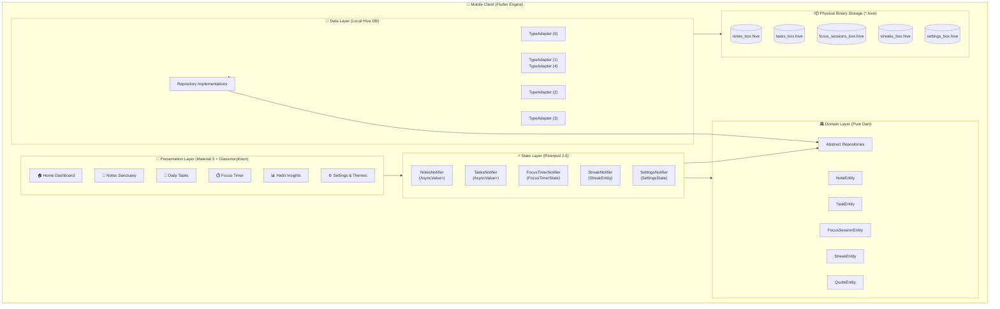
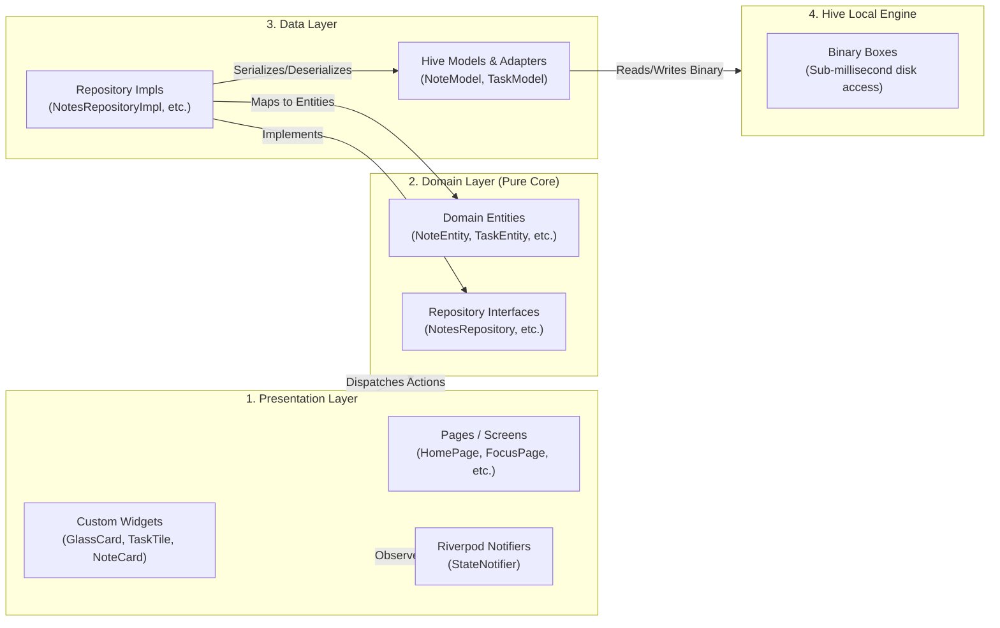
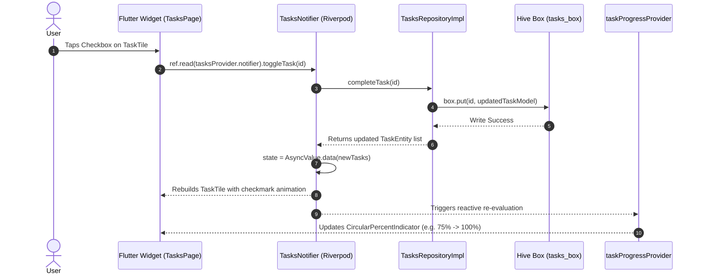
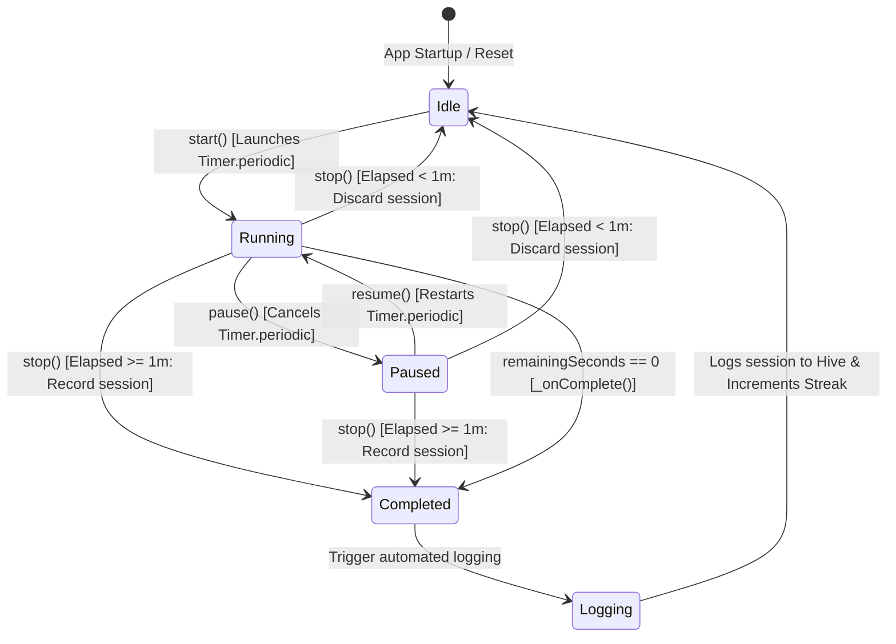
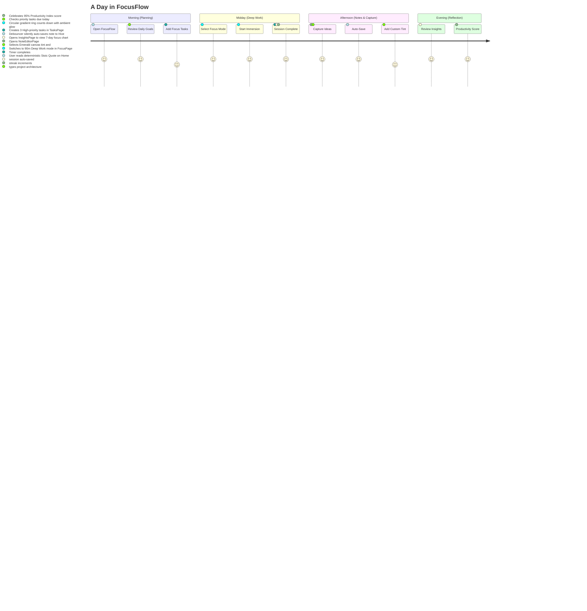

# 🏛️ FocusFlow — System Architecture & Technical Diagrams

This document provides a comprehensive visual and architectural breakdown of **FocusFlow**, using **Mermaid.js** diagrams to illustrate system hierarchy, data lifecycles, state flows, and user journeys.

---

## 1. High-Level System Architecture



---

## 2. Clean Architecture Layer Hierarchy (Feature-First)



---

## 3. Reactive State Flow (Riverpod & Hive)



---

## 4. Focus Timer State Machine Lifecycle



---

## 5. Daily Habit Streak State Machine

```mermaid
flowchart TD
    Start([User Completes Task or Focus Session]) --> QueryLastActive[Query lastActiveDate from streaks_box]
    
    QueryLastActive --> CheckNull{Is lastActiveDate null?}
    CheckNull -- Yes --> SetOne[Set currentStreak = 1]
    CheckNull -- No --> CalcDiff[Calculate difference in calendar days]
    
    CalcDiff --> DiffCases{Day Difference}
    DiffCases -- 0 Days (Same Day) --> MaintainStreak[Keep currentStreak unchanged]
    DiffCases -- 1 Day (Consecutive) --> IncStreak[Increment currentStreak += 1]
    DiffCases -- > 1 Day (Gap) --> ResetStreak[Reset currentStreak = 1]
    
    SetOne --> CheckRecord{currentStreak > longestStreak?}
    MaintainStreak --> CheckRecord
    IncStreak --> CheckRecord
    ResetStreak --> CheckRecord
    
    CheckRecord -- Yes --> UpdateRecord[longestStreak = currentStreak]
    CheckRecord -- No --> SaveDB[Update lastActiveDate = DateTime.now()]
    UpdateRecord --> SaveDB
    SaveDB --> Persist[Write StreakModel to streaks_box]
    Persist --> End([Reactive UI Update on Home & Insights])
```

---

## 6. End-to-End User Journey Map


